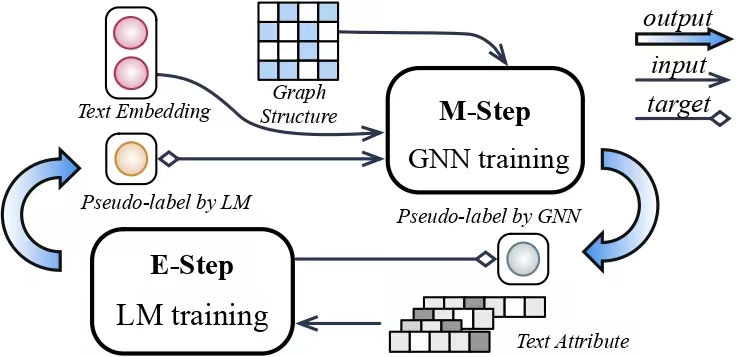

# Learning on Large-scale Text-attributed Graphs via Variational Inference
This repository is an implementation of **GLEM** - [Learning on Large-scale Text-attributed Graphs via Variational Inference](https://arxiv.org/abs/2210.14709) in ICLR 2023. Majority of the work is completed during Jianan's internship at Microsoft Research Asia. 

## Overview
The proposed GLEM framework trains GNN and LM separately in a variational EM
framework: In E-step, an LM is trained towards predicting both the gold and GNN predicted pseudolabels; In M-step, a GNN is trained by predicting both the gold and GNN predicted pseudolabels.
  


## Requirements

The core packages are as below:

- python=3.8
- ogb=1.3.3
- numpy>=1.19.5
- dgl>=0.8.0
- pytorch=1.10.2
- pyg=2.0.3

To use our exact environment, one may install the environment by the following command:
```
conda env create -f environment.yml
```

## Training
Please look the details in Readme.md of each dataset inside the OGB folder.

## Node Classification Results:

Performance on **ogbn-arxiv**(10 runs):
| Methods   | Validation accuracy  | Test accuracy  |
|  ----  | ----  |  ---- |
| GLEM+RevGAT|0.7749 ± 0.0017 | 0.7697 ± 0.0019 |
| GLEM+GAMLP |0.7695 ± 0.0014 | 0.7562 ± 0.0023 |
| GLEM+GCN   |0.7686 ± 0.0019 | 0.7593 ± 0.0019 |

Performance on **ogbn-products**(10 runs):
| Methods   | Validation accuracy  | Test accuracy  |
|  ----  | ----  |  ---- |
| GLEM+GIANT-XRT+SAGN+SCR| 0.9400 ± 0.0003 | 0.8736 ± 0.0007 |
| GLEM+GAMLP| 0.9419 ± 0.0001 | 0.8509 ± 0.0021 |

Performance on **ogbn-papers100M**(3 runs):
| Methods   | Validation accuracy  | Test accuracy  |
|  ----  | ----  |  ---- |
| GLEM+GIANT+GAMLP |0.7354 ± 0.0001 | 0.7037 ± 0.0002 |

## Citation
If you find our work useful, please consider citing our work:

```
@article{zhao2023glem,
  title={Learning on Large-scale Text-attributed Graphs via Variational Inference},
  author={Jianan Zhao and Meng Qu and Chaozhuo Li and Hao Yan and Qian Liu and Rui Li and Xing Xie and Jian Tang},
  journal={ICLR},
  year={2023}
}
```

The different models used for different datasets are referenced in the corresponding OGB subfolders
